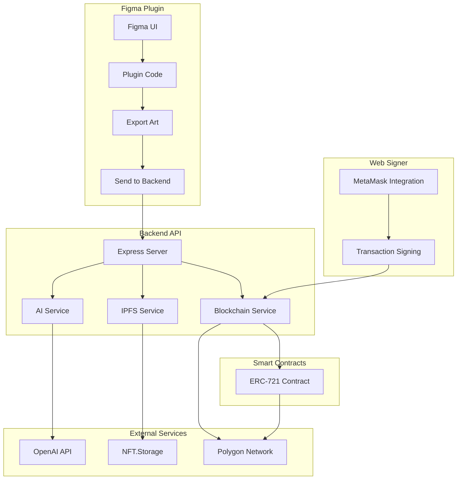
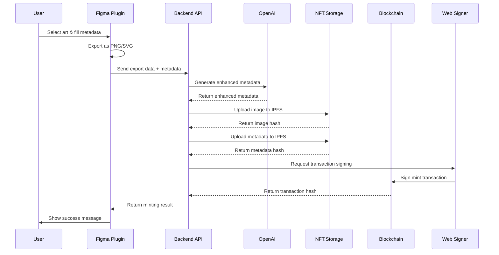
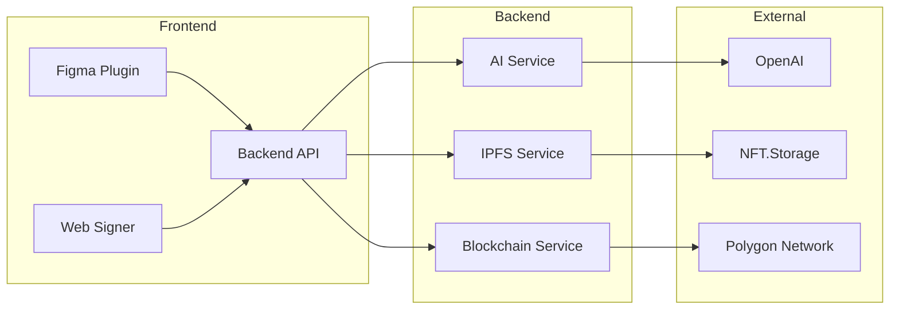

# NFT Designer Plugin - Architecture Overview

This document provides a comprehensive overview of the NFT Designer Plugin architecture, including system design, component interactions, and technical decisions.

## 🏗️ System Architecture



## 📦 Component Overview

### 1. Figma Plugin (`figma-plugin/`)

**Technology Stack**: React + TypeScript + Webpack

**Key Components**:
- `NFTDesignerUI`: Main interface component
- `ExportButton`: Handles art export
- `NFTForm`: Metadata input form
- `MintingStatus`: Progress tracking

**Responsibilities**:
- Export selected Figma art as PNG/SVG
- Provide user interface for NFT creation
- Handle user input and validation
- Communicate with backend API

**Key Files**:
- `src/code.ts`: Figma plugin sandbox code
- `src/ui.tsx`: React UI entry point
- `manifest.json`: Plugin configuration

### 2. Backend API (`backend/`)

**Technology Stack**: Node.js + Express + TypeScript

**Key Services**:
- `nftService.ts`: Main NFT minting orchestration
- `aiService.ts`: AI metadata enhancement
- `ipfsService.ts`: IPFS storage management
- `blockchainService.ts`: Smart contract interactions

**API Endpoints**:
- `POST /api/mint-nft`: Mint new NFT
- `GET /api/collections`: Get user collections
- `GET /api/analytics`: Get minting statistics
- `GET /health`: Health check

**Responsibilities**:
- Process NFT minting requests
- Generate AI-enhanced metadata
- Upload assets to IPFS
- Interact with blockchain
- Handle error management

### 3. Smart Contracts (`contracts/`)

**Technology Stack**: Solidity + Hardhat + OpenZeppelin

**Key Contracts**:
- `NFTDesigner.sol`: ERC-721 implementation
- Deployment scripts for Mumbai and Polygon

**Features**:
- ERC-721 compliant
- Pausable functionality
- Owner controls
- Batch minting support
- Gas optimization

**Responsibilities**:
- Define NFT token standard
- Handle minting logic
- Manage token ownership
- Provide metadata URI

### 4. Web Signer (`web-signer/`)

**Technology Stack**: React + TypeScript + Ethers.js

**Key Components**:
- `WebSignerInterface`: Main application
- `ConnectionStatus`: MetaMask connection
- `TransactionSigner`: Transaction signing
- `NetworkInfo`: Network management

**Responsibilities**:
- Connect to MetaMask
- Switch networks
- Sign transactions
- Provide user feedback

### 5. Shared Library (`shared/`)

**Technology Stack**: TypeScript

**Key Modules**:
- `types/`: Shared TypeScript interfaces
- `constants/`: Application constants
- `utils/`: Utility functions

**Responsibilities**:
- Provide type safety across components
- Share common utilities
- Maintain consistency
- Reduce code duplication

## 🔄 Data Flow

### 1. NFT Creation Flow



### 2. Component Communication



## 🛠️ Technical Decisions

### 1. Frontend Architecture

**Decision**: React + TypeScript for Figma plugin
**Rationale**: 
- Type safety for complex data structures
- Component reusability
- Strong ecosystem support
- Figma plugin compatibility

### 2. Backend Architecture

**Decision**: Express.js with service-oriented architecture
**Rationale**:
- Lightweight and fast
- Easy to extend with new services
- Good TypeScript support
- Simple deployment

### 3. Blockchain Choice

**Decision**: Polygon (Mumbai testnet for development)
**Rationale**:
- Low transaction costs
- Fast confirmation times
- EVM compatibility
- Strong ecosystem

### 4. Storage Solution

**Decision**: NFT.Storage for IPFS
**Rationale**:
- Decentralized storage
- Free tier available
- Easy integration
- Reliable service

### 5. AI Integration

**Decision**: OpenAI GPT-3.5-turbo
**Rationale**:
- High-quality text generation
- Cost-effective
- Easy API integration
- Good performance

## 🔐 Security Considerations

### 1. Private Key Management

- Private keys stored in environment variables
- Never committed to version control
- Used only for contract interactions
- Separate from user wallet keys

### 2. API Security

- Input validation on all endpoints
- Rate limiting to prevent abuse
- CORS configuration for allowed origins
- Error handling without sensitive data exposure

### 3. Smart Contract Security

- OpenZeppelin libraries for proven security
- Pausable functionality for emergency stops
- Owner-only administrative functions
- Gas optimization to prevent DoS

### 4. User Data Protection

- No sensitive user data stored
- Temporary data processing only
- Secure communication channels
- Privacy-focused design

## 📊 Performance Considerations

### 1. Image Processing

- Sharp library for image optimization
- Size limits to prevent large uploads
- Format conversion for compatibility
- Caching for repeated operations

### 2. API Performance

- Async/await for non-blocking operations
- Connection pooling for external services
- Timeout handling for long operations
- Error recovery mechanisms

### 3. Blockchain Performance

- Gas estimation for optimal transactions
- Retry logic for failed transactions
- Batch operations where possible
- Network monitoring

## 🔧 Development Workflow

### 1. Local Development

```bash
# Terminal 1: Backend
npm run dev:backend

# Terminal 2: Web Signer
npm run dev:web-signer

# Terminal 3: Figma Plugin
npm run dev:figma
```

### 2. Testing Strategy

- **Unit Tests**: Individual component testing
- **Integration Tests**: Component interaction testing
- **End-to-End Tests**: Complete workflow testing
- **Contract Tests**: Smart contract functionality

### 3. Deployment Strategy

- **Staging**: Mumbai testnet for testing
- **Production**: Polygon mainnet for live use
- **Rollback**: Version control for quick rollbacks
- **Monitoring**: Health checks and logging

## 🚀 Scalability Considerations

### 1. Horizontal Scaling

- Stateless backend design
- Load balancer ready
- Database abstraction layer
- Microservice architecture

### 2. Performance Optimization

- Image compression and optimization
- Caching strategies
- CDN integration potential
- Database indexing

### 3. Cost Optimization

- Efficient gas usage
- Batch operations
- Resource pooling
- Monitoring and alerting

## 🔮 Future Enhancements

### 1. Additional Blockchains

- Ethereum mainnet support
- Other EVM-compatible chains
- Layer 2 solutions
- Cross-chain functionality

### 2. Advanced Features

- Batch minting improvements
- Advanced AI models
- Custom attribute generation
- Analytics dashboard

### 3. Integration Opportunities

- Other design tools
- Marketplace integrations
- Social features
- Mobile applications

## 📈 Monitoring and Analytics

### 1. Application Metrics

- API response times
- Error rates
- User engagement
- Feature usage

### 2. Blockchain Metrics

- Transaction success rates
- Gas usage patterns
- Network performance
- Cost analysis

### 3. Business Metrics

- NFT creation volume
- User retention
- Revenue tracking
- Growth indicators

This architecture provides a solid foundation for the NFT Designer Plugin while maintaining flexibility for future enhancements and scaling requirements.
